<div align="center">


<a href="https://github.com/sor-hxr">
  
</a>
</div>
<br>

##  Profile
```json
{
  "name": "sor-hxr",
  "role": "Full-Stack Developer & Security Engineer",
  "focus": ["Web & App Development", "Network Security", "Penetration Testing"],
  "weapon": "Keyboard",
  "technique": "Heavenly Restriction. Pure skill.",
  "status": "Currently hunting bugs, not sorcerers"
}
```
<br>

##  Arsenal
<div align="center">

**Languages & Dev Toolkit**


**Security & Networking**


**OSINT & Recon**


**Databases**


**Cracking & Forensics**


</div>
<br>

##  Most Used Languages
<div align="center">
<!-- Generated by a GitHub Action into profile/top-langs.svg — see notes below -->

</div>
<br>

##  Contribution Graph
<div align="center">
<!-- This snake animation requires a one-time GitHub Actions setup — see notes below -->

</div>
<br>

<div align="center">

</div>
